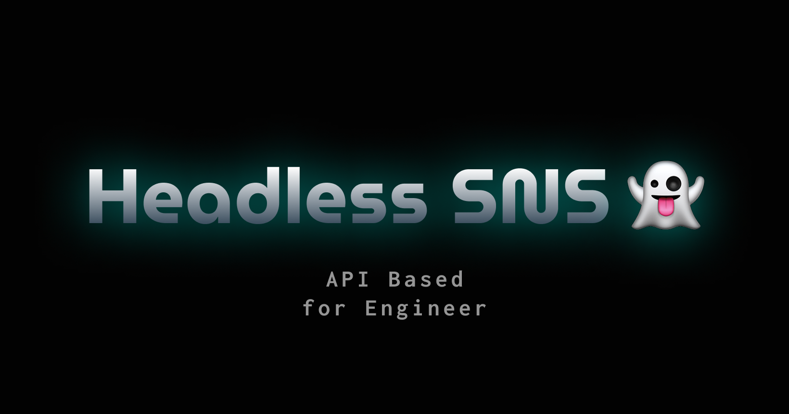

<p align="center">
    
    
    

</p>

## 概要

- このサービスはエンジニアが使うことを前提とした、フロントエンドがないヘッドレスな SNS です。
- ユーザーが直接 API を叩くことで利用することができます。

## 機能

- ユーザー登録/編集 API
- メッセージ投稿 API

## メディアの投稿

画像や動画などのメディアファイルは URL 形式で指定可能です。
投稿するにはデータ URL を指定するかご自身でセルフホスティングしてください。

## 通知

ユーザー編集から webhook を指定できます。

### 通知の種類

- いいね
- リツイート
- リプライ
- 足あと

## Run

- ローカル環境で動作のテストをする場合は以下を実行します。

```bash
npm run serve
```

- 動作確認するには、`http://127.0.0.1:5001/headless-sns/us-central1/{entryPoint}`にアクセスしてください。
- **entryPoint**は`api`です。

## Deploy

```bash
npm run deploy
```
